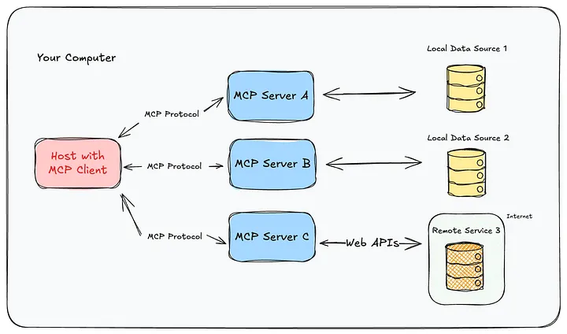

# Understanding Model Context Protocol (MCP): The Bridge Between AI and the Real World

## What is Model Context Protocol (MCP)?

**Model Context Protocol (MCP)** is an open protocol that enables AI assistants to securely connect with external data sources and tools. Think of it as a standardized communication layer that allows AI models like Claude, ChatGPT, or other AI assistants running in applications like Cursor, Claude Desktop, or VS Code to interact with real-world services and applications.

At its core, MCP is a **client-server architecture** where:
- **MCP Clients** are AI assistants or applications that need to access external capabilities
- **MCP Servers** are specialized services that expose tools and resources to these clients

The protocol defines a standardized way for AI assistants to discover, invoke, and interact with external tools—whether that's controlling your Spotify playlist, searching your WhatsApp messages, browsing the web, extracting YouTube transcripts, or querying movie databases.

## Why is MCP Useful?

### 1. **Extends AI Capabilities Beyond Training Data**

AI models are trained on static datasets with knowledge cutoffs. MCP bridges this gap by giving AI assistants **real-time access** to:
- Live data from APIs and services
- Your personal applications and accounts
- Real-world tools and automation capabilities
- Current information that wasn't in the training data

### 2. **Unified Interface for Multiple Services**

Instead of each AI assistant implementing custom integrations for every service, MCP provides a **standardized protocol**. This means:
- One protocol to learn and implement
- Consistent behavior across different AI assistants
- Easy integration of new services as MCP servers
- Reusable tools across different AI platforms

### 3. **Natural Language Control of Complex Systems**

MCP enables you to control complex applications through **simple conversational commands**. Instead of:
- Opening Spotify, searching for a song, clicking play
- Opening WhatsApp, finding a contact, typing a message
- Opening a browser, navigating to a site, extracting data

You can simply say:
- *"Play Bohemian Rhapsody on Spotify"*
- *"Send a message to John saying I'll be late"*
- *"Extract all article titles from Hacker News"*

### 4. **Privacy and Security**

MCP servers run **locally or in controlled environments**, meaning:
- Your data stays on your machine or in your control
- No need to send sensitive information to third-party AI services
- You control what tools the AI can access
- Authentication and authorization are handled at the server level

### 5. **Composability and Automation**

MCP enables **workflow automation** by combining multiple tools:
- Chain operations across different services
- Build complex automation pipelines
- Integrate AI capabilities into existing workflows
- Create powerful multi-step processes with natural language

## What Does MCP Do?

MCP serves as a **middleware layer** that:

### 1. **Exposes Tools to AI Assistants**

MCP servers define **tools** (functions) that AI assistants can call. For example:
- **Spotify MCP**: `playMusic()`, `searchSpotify()`, `createPlaylist()`, `pausePlayback()`
- **WhatsApp MCP**: `sendMessage()`, `listChats()`, `searchContacts()`, `downloadMedia()`
- **Browser MCP**: `navigate()`, `click()`, `extractText()`, `screenshot()`
- **Movies MCP**: `getMoviesByGenre()`, `searchMovies()`, `listGenres()`

### 2. **Provides Resources**

MCP servers can expose **resources** (data sources) that AI assistants can read:
- File systems
- Databases
- API endpoints
- Real-time data streams

### 3. **Enables Prompt Templates**

MCP supports **prompt templates** that can be reused across different contexts, making it easier to structure interactions with external services.

### 4. **Manages Context**

MCP helps maintain **context** across interactions, allowing AI assistants to:
- Remember previous tool calls
- Build on previous results
- Maintain state across conversations

## How Does MCP Work?

### Architecture Overview


MCP follows a **client-server model** with communication over **stdio (standard input/output)**:


```
┌─────────────────┐         MCP Protocol         ┌─────────────────┐
│   MCP Client    │ ◄─────────────────────────► │   MCP Server    │
│  (AI Assistant) │      (JSON-RPC over stdio)  │  (Service Tool) │
└─────────────────┘                              └─────────────────┘
                                                         │
                                                         ▼
                                                ┌─────────────────┐
                                                │ External Service │
                                                │ (Spotify, etc.)  │
                                                └─────────────────┘
```

### Communication Protocol

1. **Transport Layer**: MCP uses **stdio (standard input/output)** for communication, meaning:
   - The client spawns the server as a subprocess
   - Communication happens via stdin/stdout
   - This ensures secure, local communication
   - No network ports or HTTP endpoints needed

2. **Message Format**: Messages use **JSON-RPC 2.0**:
   - Request/response pattern
   - Structured JSON messages
   - Error handling
   - Method calls and notifications

3. **Initialization Handshake**:
   ```
   Client → Server: Initialize request
   Server → Client: Initialize response (with capabilities)
   Client → Server: Initialized notification
   ```

### Server Implementation

An MCP server typically:

1. **Registers Tools**: Defines what functions are available
   ```python
   @mcp.tool()
   async def get_movies_by_genre(genre: str, page: int = 1):
       """Get movies by genre"""
       # Implementation here
       return results
   ```

2. **Handles Requests**: Processes tool invocations from the client
   ```python
   # Server receives: {"method": "tools/call", "params": {"name": "get_movies_by_genre", "arguments": {"genre": "action"}}}
   # Server executes the function
   # Server returns: {"result": {"movies": [...]}}
   ```

3. **Manages Resources**: Exposes data sources that can be read
   ```python
   @mcp.resource()
   async def get_movie_details(uri: str):
       # Return resource data
       return movie_data
   ```

4. **Runs the Server**: Starts listening for requests
   ```python
   if __name__ == "__main__":
       mcp.run(transport='stdio')
   ```

### Client Integration

An MCP client (like Cursor or Claude Desktop):

1. **Configuration**: Defines which servers to connect to
   ```json
   {
     "mcpServers": {
       "spotify": {
         "command": "node",
         "args": ["/path/to/spotify-mcp/build/index.js"]
       },
       "movies": {
         "command": "python",
         "args": ["/path/to/movies-mcp-server/main.py"]
       }
     }
   }
   ```

2. **Discovery**: Queries servers for available tools and resources
   - Calls `tools/list` to get available tools
   - Calls `resources/list` to get available resources
   - Builds a catalog of capabilities

3. **Tool Invocation**: When the AI needs to use a tool:
   - AI decides which tool to call based on user request
   - Client sends `tools/call` request to appropriate server
   - Server executes the tool and returns results
   - Client provides results to AI for processing

4. **Response Handling**: Processes results and continues conversation

### Example Flow

Here's what happens when you ask: *"Play Bohemian Rhapsody on Spotify"*

1. **User Input**: You type the request in Cursor chat
2. **AI Analysis**: The AI assistant (Claude) understands it needs to play music
3. **Tool Selection**: AI identifies `playMusic` tool from Spotify MCP server
4. **Tool Call**: Client sends request to Spotify MCP server:
   ```json
   {
     "method": "tools/call",
     "params": {
       "name": "playMusic",
       "arguments": {
         "type": "track",
         "query": "Bohemian Rhapsody"
       }
     }
   }
   ```
5. **Server Execution**: Spotify MCP server:
   - Searches Spotify API for "Bohemian Rhapsody"
   - Gets track URI
   - Calls Spotify Web API to start playback
   - Returns success confirmation
6. **Response**: Server returns result to client
7. **AI Response**: AI confirms to you: *"Playing Bohemian Rhapsody by Queen"*

### Key Technical Details

- **Language Agnostic**: MCP servers can be written in any language (Python, TypeScript, Go, etc.)
- **Async Support**: Supports asynchronous operations for better performance
- **Error Handling**: Robust error reporting and handling
- **Type Safety**: Tool schemas define parameter types and validation
- **Extensibility**: Easy to add new tools and resources to existing servers

## Real-World Examples

### Spotify MCP
Control your music through natural language:
- *"Play my workout playlist"*
- *"What's currently playing?"*
- *"Create a playlist called 'Study Music' with lo-fi tracks"*

### WhatsApp MCP
Manage your messages programmatically:
- *"Show me unread messages from today"*
- *"Send a message to John saying I'll be late"*
- *"Find all messages mentioning 'meeting' this week"*

### Browser MCP
Automate web interactions:
- *"Go to Hacker News and extract all article titles"*
- *"Fill out the login form and take a screenshot"*
- *"Download all PDF files from this page"*

### Movies MCP
Discover entertainment:
- *"Show me 10 action movies"*
- *"What are some good horror films?"*
- *"Search for movies with 'batman' in the title"*

### YouTube Transcript MCP
Extract video content:
- *"Get the transcript from this YouTube video"*
- *"Summarize the main points from this video"*
- *"Extract all segments mentioning 'AI'"*

## The Future of AI Integration

MCP represents a significant step toward **composable AI systems** where:
- AI assistants become **orchestrators** of tools and services
- Users interact with complex systems through **natural language**
- Developers create **reusable integrations** that work across AI platforms
- Privacy and security are **built-in** rather than afterthoughts

As more services adopt MCP, we'll see AI assistants become true **operating systems for productivity**, seamlessly connecting the digital world through conversation.

---

**MCP transforms AI from a knowledge repository into an active agent that can interact with your digital life, making automation accessible to everyone through the power of natural language.**

